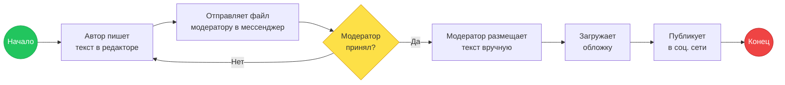
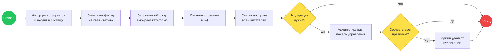
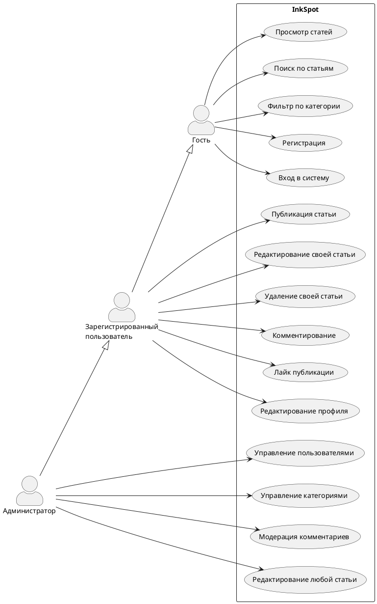
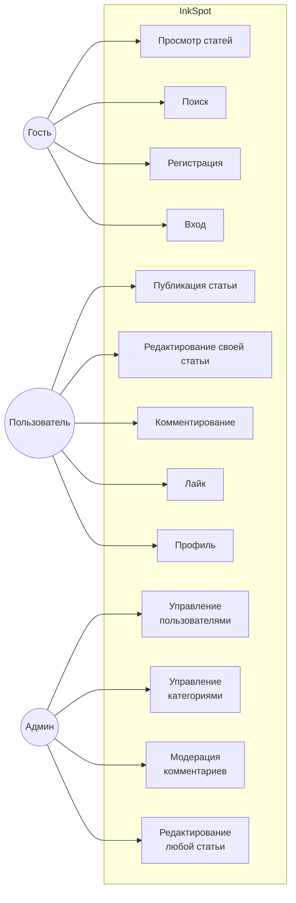
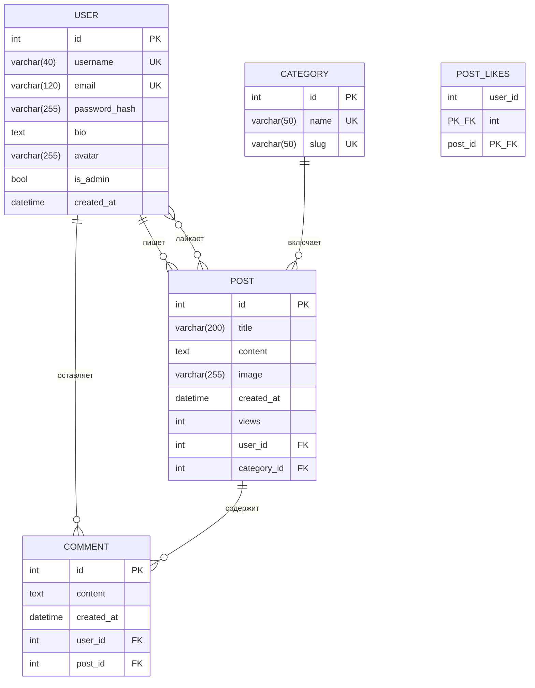
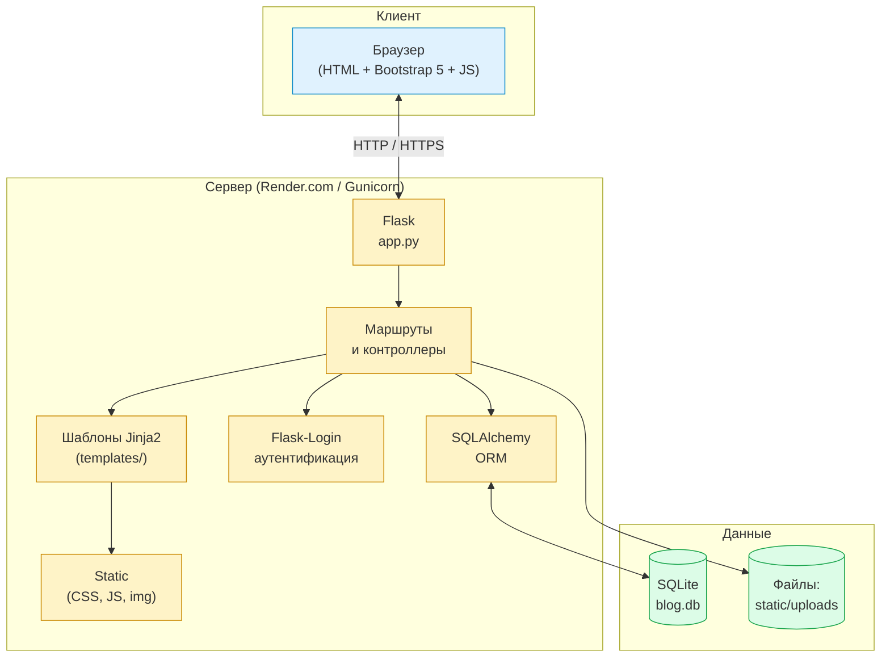
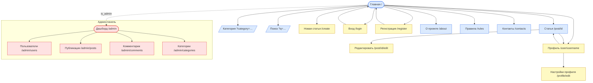

# Код диаграмм для курсового проекта InkSpot

Вставляй блоки в нужные редакторы. Где есть оба варианта (Mermaid и PlantUML) — бери тот, который удобнее.

- **Mermaid** → [mermaid.live](https://mermaid.live) — экспорт PNG/SVG
- **PlantUML** → [plantuml.com/plantuml](https://www.plantuml.com/plantuml/uml) — экспорт PNG/SVG
- **DBML (ER)** → [dbdiagram.io](https://dbdiagram.io) — экспорт PNG/SVG/PDF
- **draw.io** → [app.diagrams.net](https://app.diagrams.net) — для BPMN с правильной нотацией

---

## Рис. 1 — BPMN «как есть» (публикация контента вручную)

### Mermaid



---

## Рис. 2 — BPMN «как будет» (через InkSpot)

### Mermaid



---

## Рис. 3 — UML Use Case

### PlantUML (рекомендуется — выглядит как настоящий Use Case)



### Mermaid (если PlantUML недоступен)



---

## Рис. 4 — ER-диаграмма

### DBML для dbdiagram.io (рекомендуется — самая красивая)

```dbml
Table user {
  id integer [pk, increment]
  username varchar(40) [unique, not null]
  email varchar(120) [unique, not null]
  password_hash varchar(255) [not null]
  bio text
  avatar varchar(255)
  is_admin boolean [default: false]
  created_at datetime
}

Table category {
  id integer [pk, increment]
  name varchar(50) [unique, not null]
  slug varchar(50) [unique, not null]
}

Table post {
  id integer [pk, increment]
  title varchar(200) [not null]
  content text [not null]
  image varchar(255)
  created_at datetime
  views integer [default: 0]
  user_id integer [ref: > user.id, not null]
  category_id integer [ref: > category.id]
}

Table comment {
  id integer [pk, increment]
  content text [not null]
  created_at datetime
  user_id integer [ref: > user.id, not null]
  post_id integer [ref: > post.id, not null]
}

Table post_likes {
  user_id integer [ref: > user.id, pk]
  post_id integer [ref: > post.id, pk]
}
```

### Mermaid erDiagram (если хочется в одном формате со всем остальным)



---

## Рис. 6 — Архитектура приложения

### Mermaid



---

## Рис. 13 — Схема навигации сайта

### Mermaid



---

## Что делать с этими блоками

1. **Mermaid** — открой [mermaid.live](https://mermaid.live), вставь код, нажми **Actions → PNG/SVG**, сохрани в `docs/img/`.
2. **PlantUML** — открой [plantuml.com/plantuml](https://www.plantuml.com/plantuml/uml), вставь, скачай PNG.
3. **DBML** — открой [dbdiagram.io](https://dbdiagram.io), создай новый Diagram, вставь DBML, **Export → PNG**.
4. После того как PNG'и готовы, кинь их сюда — вставлю в `.docx` вместо серых плейсхолдеров.
